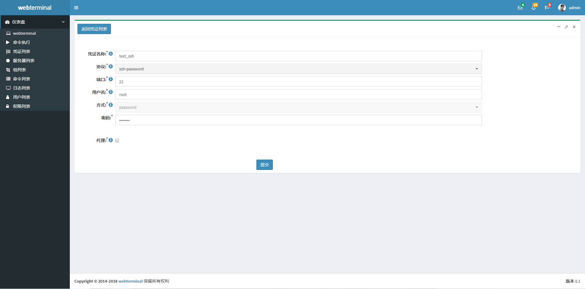
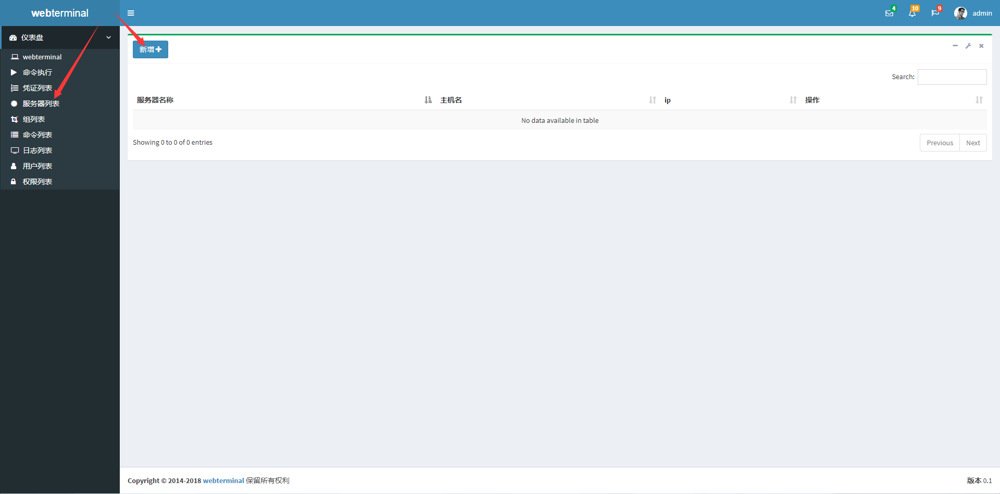
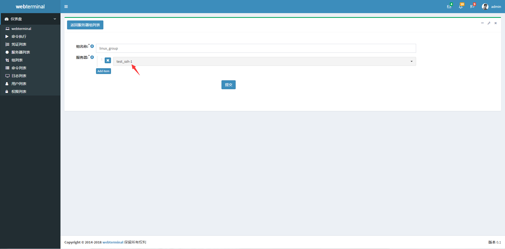
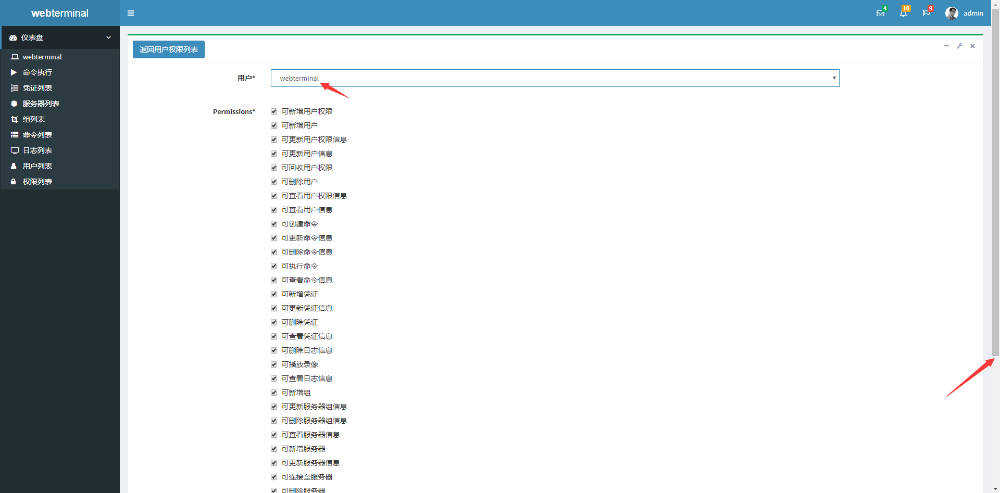
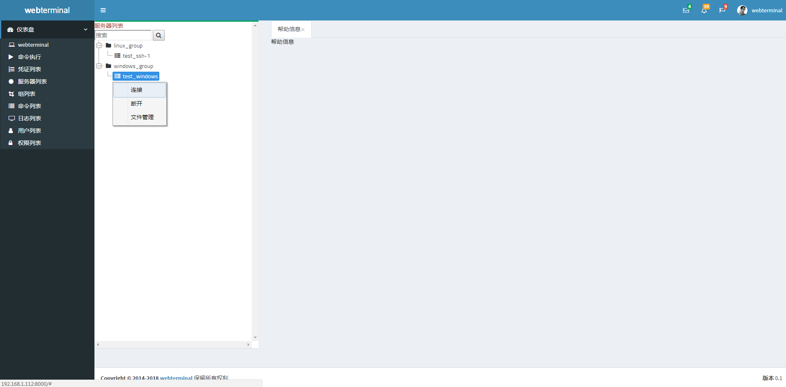
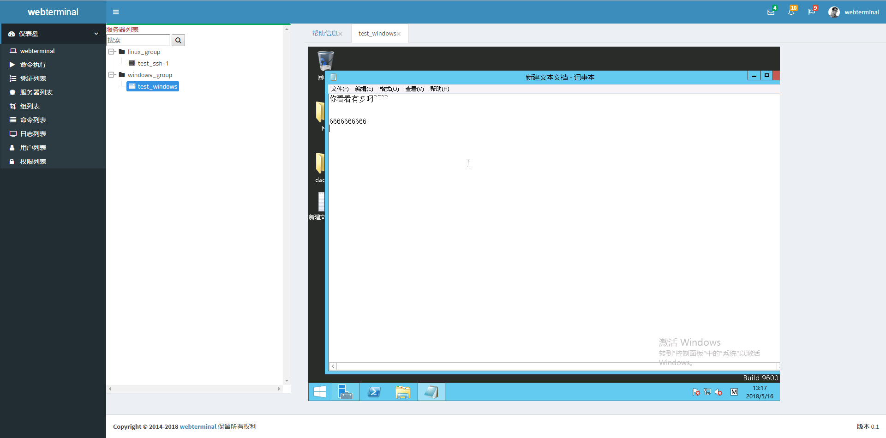
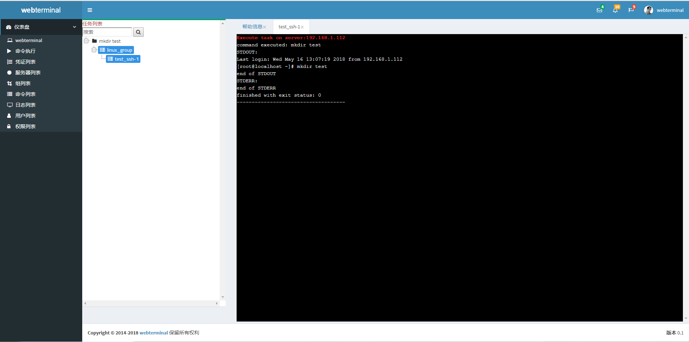

# webterminal 0.1 操作手册

# 创建资产

## 添加凭证
点击凭证列表，新增；协议支持ssh-key、sh-password、RDP、telnet等；凭证列表主要用于管理远程主机时的账号、密码，及使用的远程协议。

这里以sh-password为例。

这里以rdp为例子。

## 添加服务器

点击服务器列表-新增服务器资产

这里以添加linux 主机为例。凭证选择刚刚添加的“test_ssh”

这里以添加windows主机为例。凭证选择刚刚添加的“test_windows”

## 添加服务器组
将服务器添加进组中：点击组列表。

以linux服务器组为例

以windows服务器组为例

# 创建用户与授权

## 创建用户
用户列表用于管理运维人员登陆账号

创建用户

## 用户授权

点击权限列表项，下拉可选择用户（用户列表中的用户）；默认拥有所有权限；权限选择完。

在最下面服务器组中作用的服务器组（在组列表中那些组)。

可选择多服务器组

# 使用webterminal连接远程主机

使用新建立的用户“webterminal” 登录。右击连接。

（目前Windows主机尚不支持文件管理功能）

# 添加命令用于批量操作

点击命令列表，新增test命令，在命令执行下可看到多了一个test命令列表，点击test的执行选项就会对服务器组下的所有主机执行”mkdir test”，

返回到命令执行，选择主机右击执行。

可选择组进行批量执行。

连接主机，发现根目录下多了一个test.txt文件夹

# 日志列表为连接实时查看与录像回放

当一个用户打开一个服务器进行操作时，拥有权限用户可点击日志列表进行监控查看实时动态！

当用户断开连接后，拥有权限用户可查看连接操作历史录像回放！

